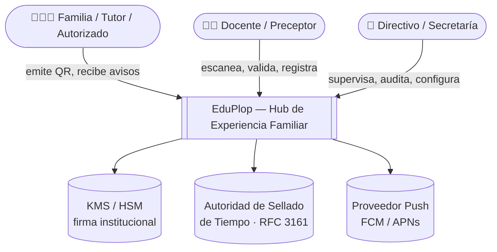
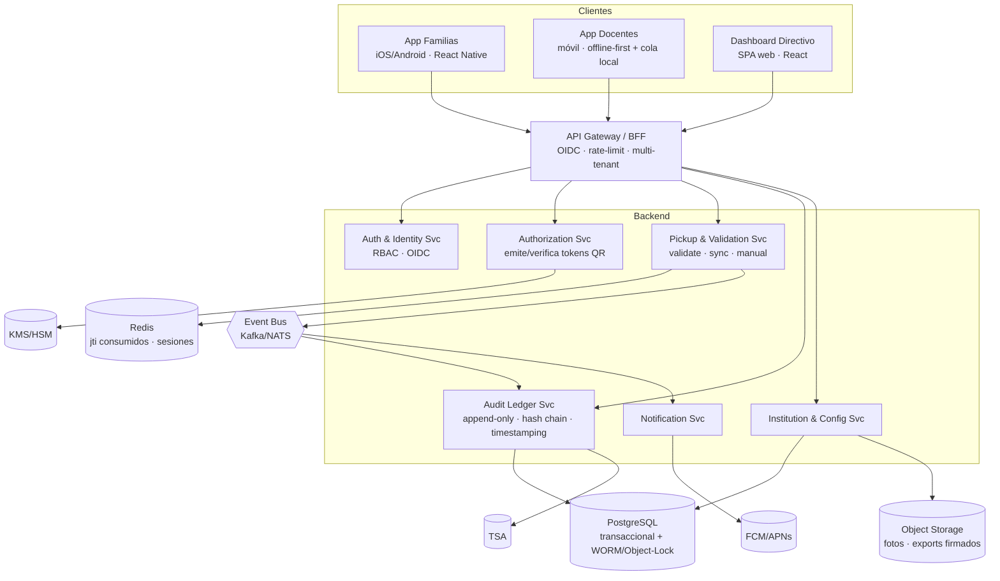
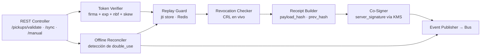

# 07 — Arquitectura C4

Vista de arquitectura siguiendo el modelo C4 (Contexto → Contenedores → Componentes).
Diagramas en texto/Mermaid para versionado en repositorio.

---

## Nivel 1 — Contexto del Sistema

El sistema es **B2B2C**: la institución (B) contrata; familias y personal (C) operan.

---

## Nivel 2 — Contenedores

**Decisiones clave de contenedores**
- **App Docentes offline-first:** mantiene `provisioning bundle` (clave pública, roster, CRL) y
  **cola local firmada**; verifica firma+TTL sin red (ver `02`/`03`).
- **Pickup Svc** publica eventos al **Event Bus**; el **Ledger Svc** los consume y los asienta de
  forma append-only → desacople y orden total.
- **KMS/HSM** custodia la clave privada institucional; los dispositivos solo portan la **pública**.

---

## Nivel 3 — Componentes (Pickup & Validation Service)

---

## Atributos de calidad (cómo la arquitectura los soporta)

| Atributo | Mecanismo arquitectónico |
|---|---|
| **Disponibilidad en el pico** | App docente offline-first + validador autónomo; backend stateless escalable horizontal. |
| **Integridad / no repudio** | Firma KMS + doble atestación dispositivo/servidor + hash chain + TSA + WORM. |
| **Escalabilidad** | Event bus desacopla validación de auditoría; lecturas servidas por proyecciones (CQRS). |
| **Multi-tenancy** | Scoping por `institution_id` en gateway; aislamiento lógico de datos. |
| **Seguridad** | OIDC + RBAC, PII cifrada en reposo, claves de dispositivo revocables, sin PII en el QR. |
| **Auditabilidad** | Ledger append-only consultable + verificación de cadena + export legal firmado. |

---

## Estrategia de despliegue (resumen)
- **Contenedores** (Docker) sobre **Kubernetes**; servicios stateless con autoscaling.
- **PostgreSQL** gestionado con réplicas de lectura + bucket con **Object Lock** para WORM.
- **CDN** para assets/fotos; **observabilidad** con OpenTelemetry (trazas del flujo de retiro).
- **Entornos**: dev → staging → prod, con datos sintéticos en no-prod (sin PII real).
